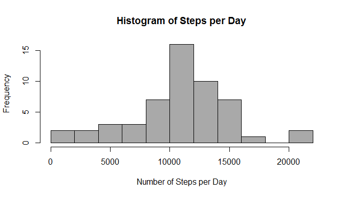
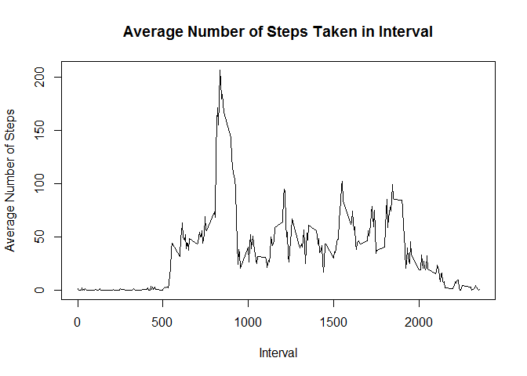
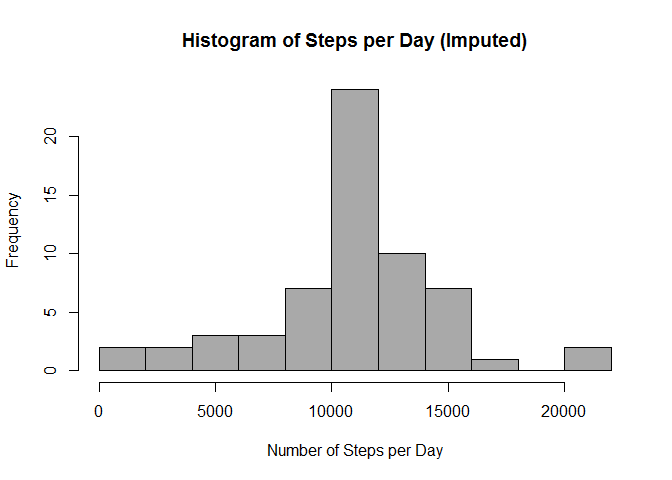
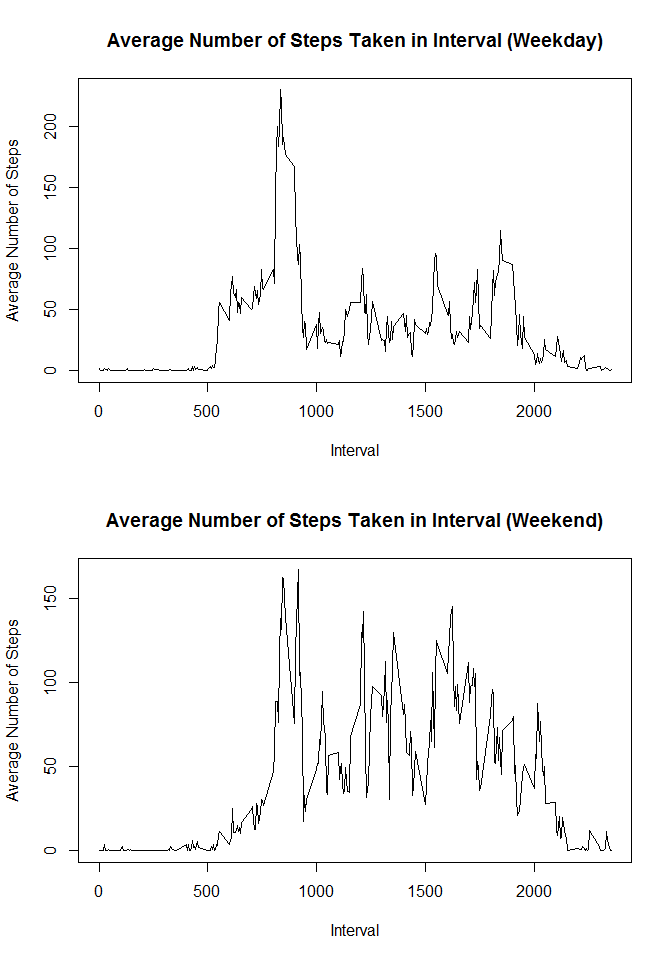

# Reproducible Research: Peer Assessment 1

### Loading and preprocessing the data  

This document will walk through an analysis of data collected through an individual's personal monitoring device. It contains two month's of observations collected throughout October and November of 2012, at 5 minute intervals. Each observation contains the number of steps recognized that the individual made throughout the interval observed. The original dataset that is used for this analysis can be found in [here](https://d396qusza40orc.cloudfront.net/repdata%2Fdata%2Factivity.zip).  

First, we begin by loading the data into R. We assume that the raw dataset ("activity.csv") is already saved in the R session's current working directory.


```r
        activity <- read.csv("activity.csv", stringsAsFactors = FALSE)
```
  
We can see that the field "date" was read in as a 'character' type.  


```r
        class(activity$date)
```

```
## [1] "character"
```
  
Below we  convert this to a more proper date format, prior to moving forward with any analysis.  


```r
        activity$date <- as.Date(activity$date)
```
  
### What is the mean total number of steps taken per day?
  
The first part of our analysis will require us to determine the total number of steps taken each day. The below performs this computation and stores it into a new variable, 'stepsPerDay'. Note that we ignore NA values for this part of our analysis.


```r
        stepsPerDay <- aggregate(steps ~ date, data = activity, sum, na.rm = TRUE)
```
  
Now we display a histogram of our findings for total number of steps for each day.  


```r
        hist(stepsPerDay$steps, breaks = 10, main = "Histogram of Steps per Day",
        xlab = "Number of Steps per Day", col = "darkgrey")
```

<!-- -->
  
Further analysis will allow us to calculate the mean and median number of steps per day.
  

```r
        options(scipen = 999)
        meanStepsPerDay <- round(mean(stepsPerDay$steps),2)
        medianStepsPerDay <- round(median(stepsPerDay$steps),2)
```
  
We can now say that this individual took a mean of 10766.19 steps per day and a median of 10765 steps per day.  
  
### What is the average daily activity pattern?  
  
Next, we'll make a time series plot of the 5 minute intervals and the average number of steps taken, averaged across all days.


```r
        stepsPerInterval <- aggregate(steps ~ interval, data = activity, mean, na.rm = TRUE)
        plot(stepsPerInterval$interval, stepsPerInterval$steps, type = "l", main = 
        "Average Number of Steps Taken in Interval", xlab = "Interval", 
        ylab = "Average Number of Steps")
```

<!-- -->

Further analysis allows us to determine the interval that, on average, contains the highest number of steps across all days.


```r
        maxStepsInterval <- stepsPerInterval$interval[which.max(stepsPerInterval$steps)]
        maxStepsValue <- stepsPerInterval$steps[which.max(stepsPerInterval$steps)]
```
  
We now know that the interval 835 contains the highest number of average steps taken, with an average of 206.1698113.  

### Imputing Missing Values

There are a number of missing values within the dataset. Missing values are denoted by 'NA' within the dataset.  


```r
        numberMissingValues <- sum(is.na(activity$steps))
```

To be precise, there are 2304 missing values in the original dataset.  
  
We now make the assumption that any missing values should be replaced with the average value for that 5 minute interval, as established in the 'stepsPerInterval' object. We save this new dataset into an object 'activityImputed'  


```r
        activityImputed <- activity
        for(i in 1:nrow(activityImputed)){
                if(is.na(activityImputed$steps[i])){
                        match <- which(activityImputed$interval[i] == stepsPerInterval$interval)
                        activityImputed$steps[i] <- stepsPerInterval[match,]$steps
                }
        }
```
  
Now we create a histogram of our new, imputed dataset.  


```r
        stepsPerDayImputed <- aggregate(steps ~ date, data = activityImputed, sum)
        hist(stepsPerDayImputed$steps, breaks = 10, main = "Histogram of Steps per Day (Imputed)",
        xlab = "Number of Steps per Day", col = "darkgrey")      
```

<!-- -->
  
Now we calculate the mean and median using our imputed dataset.


```r
        meanStepsPerDayImputed <- round(mean(stepsPerDayImputed$steps),2)
        medianStepsPerDayImputed <- round(median(stepsPerDayImputed$steps),2)    
```
  
We can now say that this individual took a mean of 10766.19 steps per day and a median of 10766.19 steps per day, when using our imputed dataset. The mean remained unchanged,since we imputed with the mean values for each interval. But the median moved slightly up and now matches the mean.  

### Are there differences in activity patterns between weekdays and weekends?  

Let's first add an identifier to our dataset that distinguishes weekdays from weekends.  


```r
        activityImputed$dateCategory <- "Weekday"
        for(i in 1:nrow(activityImputed)){
                if(weekdays(activityImputed[i,]$date) %in% c("Saturday", "Sunday")){
                        activityImputed[i,]$dateCategory <- "Weekend"
                }
        }
        activityImputed$dateCategory <- as.factor(activityImputed$dateCategory)
```
  
Next we calculate the average number of steps taken during each 5 minute interval.  


```r
        stepsPerIntervalWeekday <- aggregate(steps ~ interval, data = subset(activityImputed, 
        activityImputed$dateCategory == "Weekday"), mean)
        stepsPerIntervalWeekend <- aggregate(steps ~ interval, data = subset(activityImputed, 
        activityImputed$dateCategory == "Weekend"), mean)
```

Now let's create a plot of our results.  


```r
        par(mfrow = c(2,1))
        plot(stepsPerIntervalWeekday$interval, stepsPerIntervalWeekday$steps, type = "l", main = 
        "Average Number of Steps Taken in Interval (Weekday)", xlab = "Interval", 
        ylab = "Average Number of Steps")
        plot(stepsPerIntervalWeekend$interval, stepsPerIntervalWeekend$steps, type = "l", main = 
        "Average Number of Steps Taken in Interval (Weekend)", xlab = "Interval", 
        ylab = "Average Number of Steps")
```

<!-- -->
